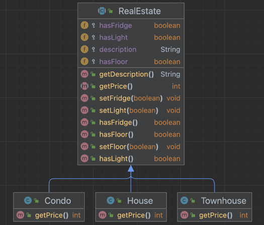
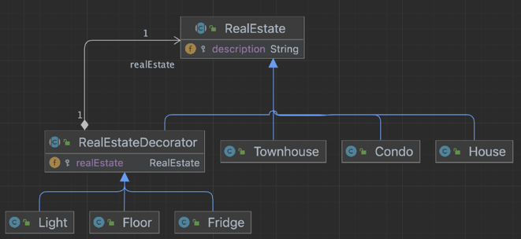

# CS5004-Decorator_Design_Patterns

## **Introduction**

### Decorator design pattern - Definition and Benefits

#### Definition:

1. The decorator pattern is a structural design pattern that allows behavior to be dynamically added to an individual object, without affecting the behavior or structure of other objects from the same class.
2. In other words, the decorator pattern is designed to add responsibilities to objects without subclassing.
3. The Decorator Pattern uses composition instead of inheritance to extend the functionality of an object at runtime, and it is also known as Wrapper.

#### Benefits:

1. The decorator pattern exploits the composition of classes to gain flexibility at runtime.
2. They can be used to modify existing systems where we wish to add additional features to objects without the need to heavily modify the underlying code using them - Open/Closed Principle
3. The decorator adds its own behavior before and/or after delegating to the object it decorates to do the rest of the job - Single Responsibility Principle
4. Objects can be decorated at any time, so we can decorate objects dynamically at runtime with as many decorators as we like.

...feel free to add

## A Real-Life Problem

...describe the story of our company here

### Designing a Base Case

...
add base case diagram here

### Designing Decorations

#### **1. Initial Attempt**
...add comments here

...add comments here

#### **2. Some Improvements**
...add comments here

...add comments here

#### **3. Decorator Pattern!!!**
Now we have seen that representing our real estate and decorations with inheritance does not seem to be appropriate.
It introduces problems such as class explosions and rigid designs, or we add many methods to the base class that is
not necessary for some subclasses. Those designs violate SOLID principle. It's time to think about altering it to
decorator pattern.

So, how to build a decorator pattern? Let's take a look at a decorator UML class diagram.

Source:https://learning.oreilly.com/library/view/learning-javascript-design/9781449334840/ch09s14.html

1. Decorators have the same supertype as the objects they decorate.
2. Each component can be used on its own or “wrapped” by a component
3. Each decorator “has-a” (wrap) a component, meaning it has an instance variable that holds a reference to a component.

We will perform the following: starting with a real estate and decorate it with the decorations at runtime.
For example, if a customer wants to bundle a Townhouse with Floor and Light, we will:

1. Start with a Townhouse object.
2. Decorate it with a Floor object.
3. Decorate it with a Light object.
4. Call the getPrice() method and rely on delegation to add up the decoration cost.

Here is our design diagram:

In package decorator, 

package decorator;

/**
* represents a Townhouse product.
  */
  public class Townhouse extends RealEstate {

/**
* constructs a Townhouse product.
  */
  public Townhouse(){
  this.description = "Townhouse";
  }

@Override
public int getPrice() {
return 1500000;
}
}

